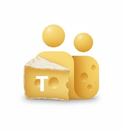

# OST client := Open Source Teams client

A command-line client for Microsoft Teams written in Rust.

*Ost* means cheese in Danish.



## Features

- **Authentication**: OAuth2 device code flow for work/school and personal accounts
- **Messaging**: List chats, read messages, send messages (stable)
- **Teams**: List joined teams and channels (stable)
- **Real-time**: WebSocket connection for push notifications (Trouter)
- **Calling**: Audio and video calls with RTP/SRTP media
- **Audio** (optional): Microphone capture and speaker playback (working)
- **Video** (optional): Camera capture via V4L2 and SDL2 display (WIP)

## Status

| Feature | Status |
|---------|--------|
| Authentication | Stable |
| Chat / Messaging | Stable |
| Teams / Channels | Stable |
| Trouter (push) | Stable |
| Audio calls | Working |
| Video calls | WIP - may cause audio issues |

**Note**: Video support is work-in-progress. Building with `--features video-capture` may interfere with audio functionality. For reliable audio calls, use `--features audio` only.

## Requirements

- Rust 1.70+ (some dependencies are pinned for compatibility with older rustc versions)
- Linux (for audio/video features)
- Nix (recommended) or manual dependency installation
- [just](https://github.com/casey/just) command runner (optional, for convenience recipes)

### Dependencies

- **Audio**: ALSA development libraries
- **Video**: V4L2, SDL2, OpenH264

## Installation

### Using Nix (recommended)

The `shell.nix` provides all required dependencies. The `just` command runner executes recipes from the `Justfile`.

```bash
nix-shell
just build
```

### Manual

Install dependencies, then:

```bash
cargo build
```

For audio support:
```bash
cargo build --features audio
```

For video support:
```bash
cargo build --features video-capture
```

For full A/V support:
```bash
cargo build --features "audio,video-capture"
```

## Usage

### Authentication

Login with device code flow:

```bash
teams-cli login
```

Force re-authentication (ignores cached token):

```bash
teams-cli login --force
```

Check authentication status:

```bash
teams-cli status
teams-cli whoami
```

### Messaging

List recent chats:

```bash
teams-cli chats
```

Read messages from a chat:

```bash
teams-cli read <chat-id> --limit 20
```

Send a message:

```bash
teams-cli send --to <chat-id> "Hello from CLI!"
```

### Teams

List joined teams and channels:

```bash
teams-cli teams
```

### Real-time Notifications

Connect to Trouter for push notifications:

```bash
teams-cli trouter
```

### Calling

Test microphone (requires `--features audio`):

```bash
teams-cli mic-test
```

Test camera (requires `--features video-capture`):

```bash
teams-cli cam-test
```

Place a test call to Echo bot:

```bash
teams-cli call-test --echo --duration 20
```

## CLI Reference

```
teams-cli [OPTIONS] <COMMAND>

Options:
  -v, --verbose  Enable debug logging

Commands:
  login      OAuth2 device code authentication
             --force    Force re-login even if cached token exists
  logout     Clear stored credentials
  status     Show token expiry status
  whoami     Verify authentication
  chats      List recent chats
             --limit N  Number of chats to show
  read       Read messages from a chat
             --limit N  Number of messages to show
  send       Send a message
             --to ID    Chat ID to send to
  teams      List joined teams and channels
  presence   Get/set presence status
  trouter    Connect to push notification service
  call-test  Place a test call
             --echo       Call the Echo bot (call quality tester)
             --duration N Call duration in seconds (default: 30)
             --thread ID  1:1 chat thread ID to call
             --record     Enable call recording
             --camera     Enable camera capture (video-capture feature)
             --display    Enable video display window (video-capture feature)
             --tone       Use test tone instead of microphone
  mic-test   Test microphone (audio feature)
  cam-test   Test camera (video-capture feature)
```

## Testing

### Unit Tests

Run the test suite:

```bash
just test
# or
cargo test
```

### End-to-End Tests

E2E tests require a valid login session. Run all e2e tests:

```bash
just e2e
```

Individual e2e tests:

| Test | Description |
|------|-------------|
| `tests/e2e_trouter.sh` | Trouter WebSocket connection |
| `tests/e2e_chats.sh` | Chat listing |
| `tests/e2e_read.sh` | Message reading |
| `tests/e2e_teams.sh` | Teams/channels listing |
| `tests/e2e_echo123.sh` | Echo bot call test |

### Quality Checks

```bash
just check    # Run fmt-check, lint, and compile tests
just lint     # Run clippy lints
just fmt      # Format code
```

## Configuration

Tokens are stored in `~/.config/teams-cli/config.toml` with restricted permissions (0600).

## Documentation

- [Architecture Diagrams](docs/architecture.md) - Visual diagrams of authentication, messaging, calling, and media flows
- [Terminology Index](docs/terminology_index.md) - Glossary of protocols and terms (RTP, SRTP, ICE, SDP, etc.)
- [GUIDs Reference](docs/GUIDs.md) - Known Microsoft GUIDs (OAuth client IDs, tenant IDs, SEI UUIDs, bot MRIs)

## License

MIT License - see LICENSE file.

## Disclaimer

This is an unofficial client. Use at your own risk. Not affiliated with Microsoft.

## Related Projects

- [purple-teams](https://github.com/EionRobb/purple-teams/) - Teams plugin for libpurple (Pidgin, Finch, etc.)
