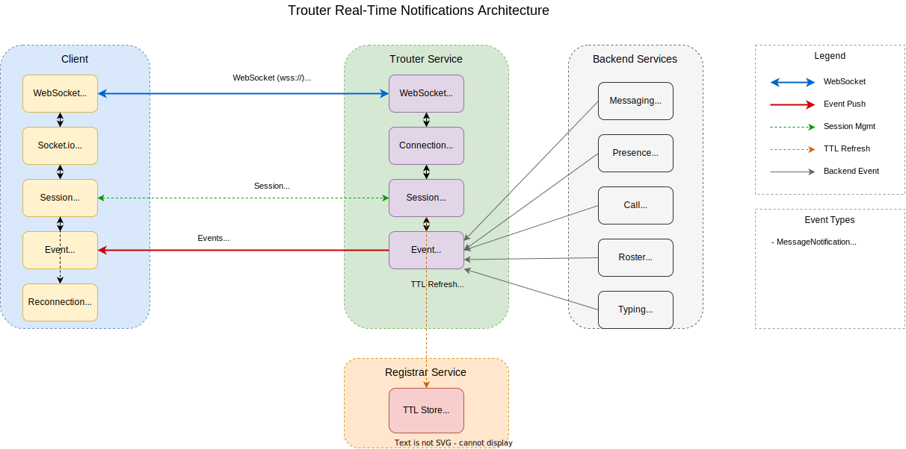
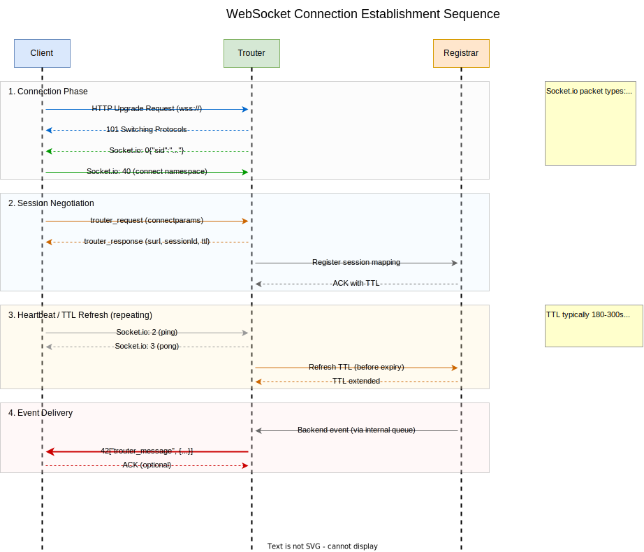
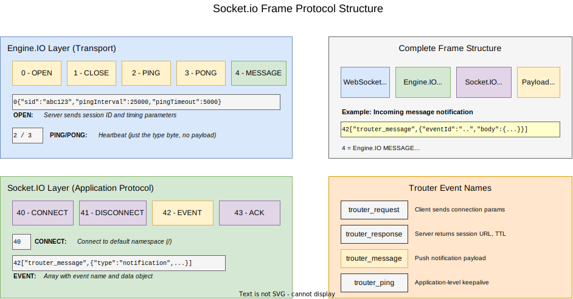
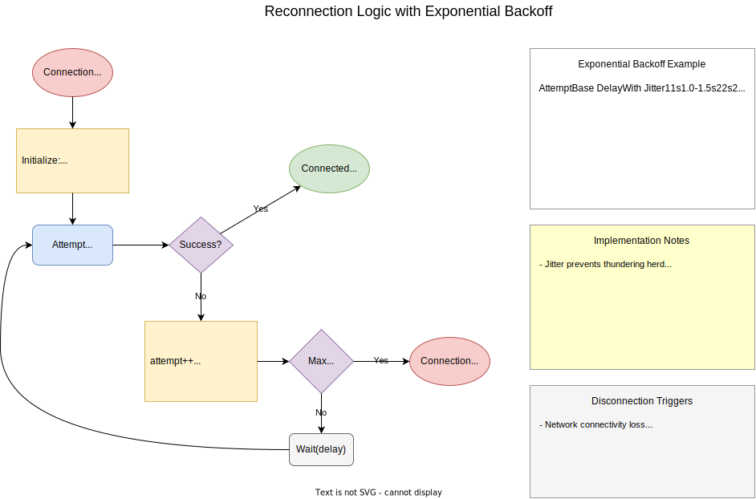

# Architecture

Visual diagrams of the Teams CLI architecture and protocols.

## Authentication & Configuration

### Auth Tokens

### Config Persistence

## Messaging & Teams

### Messaging & Chat

### Teams & Channels

### Presence

## Real-time Notifications (Trouter)

### Trouter Overview

### Trouter Connection

### Message Sequence

### Message Framing

### Reconnection

## Calling & Signaling

### Call Types

### Call Signaling

### Media Session Setup

## Network & Connectivity

### ICE / STUN / TURN

### HTTP API Infrastructure

## Media Streaming

### Audio Streaming

### Video Streaming

### SRTP Encryption

### Protocol Wire Formats

## Recording

### Recording Integration

